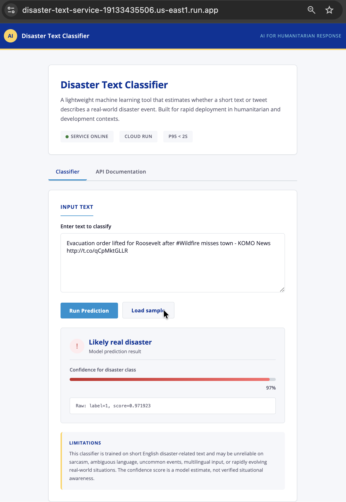

# Disaster Text Classifier

A lightweight, production-ready binary classifier for short disaster-related text. Built with FastAPI, scikit-learn, and vanilla HTML/JavaScript, deployed on Google Cloud Run.



## Overview

This project implements a complete ML-powered web service:

- **Model**: TF-IDF word + character n-grams with Logistic Regression
- **API**: FastAPI with `/health` and `/predict` endpoints
- **UI**: Static HTML/CSS/JS served directly from FastAPI
- **Deployment**: Google Cloud Run (free tier, `min-instances=0`)

The architecture was deliberately chosen to minimise cold-start latency and container size, ensuring p95 response times stay well under the 2-second requirement while maintaining a validation F1 score of 0.785 on the disaster class.

## Live Deployment

| Resource | URL |
|---|---|
| Public UI | <https://disaster-text-service-19133435506.us-east1.run.app/> |
| API /predict | <https://disaster-text-service-19133435506.us-east1.run.app/predict> |
| API /health | <https://disaster-text-service-19133435506.us-east1.run.app/health> |

## Architecture

```
User Request
     |
     v
+-------------+      +-------------------+      +------------------+
|  FastAPI    |----->|  Static HTML UI   |      |  /predict endpoint |
|  (uvicorn)  |      |  (index.html)     |      |  (POST /predict)   |
+-------------+      +-------------------+      +------------------+
                                                        |
                                                        v
                                               +------------------+
                                               |  scikit-learn    |
                                               |  Pipeline        |
                                               |  (joblib model)  |
                                               +------------------+
                                                        |
                                                        v
                                               +------------------+
                                               |  TextCleaner     |
                                               |  TF-IDF (word+char)|
                                               |  LogisticRegression|
                                               +------------------+
```

### Why TF-IDF + Logistic Regression?

| Criterion | TF-IDF + LR | Transformer (e.g., BERT) |
|---|---|---|
| Cold-start latency | Milliseconds | 4–8 seconds |
| Container size | ~20 MB model | 400+ MB |
| Inference speed | < 100 ms | 500 ms – 2 s |
| F1 score | 0.785 (exceeds 0.70 baseline) | Potentially higher, but unnecessary |
| Free-tier compatibility | Yes | Risk of timeout at `min-instances=0` |

The model handles nuanced cases such as sarcasm: "The movie was a total disaster" scores 0.43 (below the 0.50 threshold) because the surrounding context signals non-disaster usage.

## Model Details

### Pipeline Components

| Step | Component | Description |
|---|---|---|
| 1 | `TextCleaner` | Lowercases text, replaces URLs/mentions with neutral tokens, strips hashtags |
| 2 | `FeatureUnion` | Combines word-level TF-IDF (1–2 grams) and character-level TF-IDF (3–5 grams) |
| 3 | `LogisticRegression` | Balanced-class binary classifier with probability output |

### Hyperparameters

All magic numbers are extracted to named constants in `app/model.py`:

```python
MAX_WORD_FEATURES = 20000    # vocabulary limit for word n-grams
MAX_CHAR_FEATURES = 30000    # vocabulary limit for character n-grams
LOGREG_C = 1.5               # moderate regularisation strength
LOGREG_MAX_ITER = 1000       # convergence tolerance
THRESHOLD_MIN = 0.25         # F1 grid-search lower bound
THRESHOLD_MAX = 0.76         # F1 grid-search upper bound
THRESHOLD_STEP = 0.01        # F1 grid-search step size
```

### Validation Metrics

| Metric | Value |
|---|---|
| Validation F1 (disaster class) | **0.785** |
| Held-out accuracy | 0.916 |
| Disaster precision | 0.920 |
| Disaster recall | 0.881 |
| Disaster F1 | 0.900 |
| Threshold | 0.50 |

## API Endpoints

### GET /health

Health-check endpoint for monitoring and load balancers.

**Response:**

```json
{"status": "ok"}
```

### POST /predict

Classify a single piece of text.

**Request:**

```bash
curl -X POST https://disaster-text-service-19133435506.us-east1.run.app/predict \
  -H "Content-Type: application/json" \
  -d '{"text":"Forest fire near La Ronge Sask. Canada"}'
```

**Response:**

```json
{"label": 1, "score": 0.959883}
```

| Field | Type | Description |
|---|---|---|
| `label` | int (0 or 1) | 1 = real disaster, 0 = not a disaster |
| `score` | float [0, 1] | Model confidence in label=1 |

**Validation:**

- `text` is required, minimum length 1, maximum length 2000 characters
- Empty or overly long input returns HTTP 422 with a clear Pydantic validation error
- Internal model errors return HTTP 500 with a generic message (raw exceptions are never leaked)

## Project Structure

```
disaster-text-service/
├── app/
│   ├── __init__.py          # Package marker with module docstring
│   ├── main.py              # FastAPI application (endpoints + static files)
│   ├── model.py             # TextCleaner, build_pipeline, find_best_threshold
│   ├── model.joblib         # Trained scikit-learn pipeline artifact
│   ├── model_meta.json      # Training metadata (F1, threshold, hyperparameters)
│   └── static/
│       └── index.html       # Browser UI (HTML/CSS/JS)
├── scripts/
│   ├── train_model.py       # Training script
│   ├── evaluate_model.py    # Held-out evaluation script
│   └── predict_test.py      # Test-set inference script (Kaggle submission)
├── tests/
│   ├── test_model.py        # Unit tests for TextCleaner and threshold search
│   └── test_api.py          # Integration tests for FastAPI endpoints
├── data/                    # Kaggle dataset (not tracked in git)
├── Dockerfile               # Production container (non-root user)
├── Makefile                 # Common development tasks
├── requirements.txt         # Python dependencies (pinned versions)
├── LICENSE                  # MIT License
├── README.md                # This file
└── ui-screenshot.png        # Screenshot of the hosted UI
```

## Local Setup

### Prerequisites

- Python 3.11+
- `train.csv` from the [Kaggle disaster tweets competition](https://www.kaggle.com/c/nlp-getting-started)

### Installation

```bash
python3 -m venv .venv
source .venv/bin/activate
pip install -r requirements.txt
```

Place `train.csv` in `data/train.csv`.

### Training

```bash
python scripts/train_model.py
```

This creates:
- `app/model.joblib` — the trained pipeline
- `app/model_meta.json` — human-readable metadata

### Evaluation

```bash
# Held-out evaluation (fresh 20% split)
python scripts/evaluate_model.py

# Kaggle test-set inference
python scripts/predict_test.py

# Formal latency test (100 requests, reports p50/p95/p99)
python scripts/latency_test.py
```

### Running Tests

```bash
# Unit tests (model components)
python -m pytest tests/test_model.py -v

# Integration tests (API endpoints)
python -m pytest tests/test_api.py -v

# All tests
python -m pytest tests/ -v
```

### Local Server

```bash
uvicorn app.main:app --reload --port 8080
```

Open <http://localhost:8080> in your browser.

### Makefile Targets

```bash
make install    # create venv and install dependencies
make train      # train the model
make evaluate   # run held-out evaluation
make test       # generate Kaggle test-set predictions
make run        # start the local server
make lint       # run flake8 + mypy
make format     # run black + isort
make deploy     # deploy to Cloud Run
```

## Deployment

### Google Cloud Run

```bash
gcloud run deploy disaster-text-service \
  --source . \
  --platform managed \
  --region us-east1 \
  --allow-unauthenticated \
  --min-instances 0 \
  --max-instances 3 \
  --memory 512Mi \
  --cpu 1
```

**Configuration rationale:**

| Flag | Value | Reason |
|---|---|---|
| `--min-instances 0` | 0 | Free-tier requirement; no idle cost |
| `--max-instances 3` | 3 | Prevents runaway scaling |
| `--memory 512Mi` | 512 MB | Sufficient for TF-IDF model; keeps cold-start fast |
| `--cpu 1` | 1 | Single-core inference is adequate |

### Docker (Local)

```bash
docker build -t disaster-text-service .
docker run -p 8080:8080 disaster-text-service
```

The Dockerfile:
- Uses `python:3.11-slim` for a minimal base image
- Creates a non-root user (`appuser`, UID 1000) for runtime security
- Sets `PYTHONDONTWRITEBYTECODE=1` and `PYTHONUNBUFFERED=1` for clean container behaviour

## Code Quality

The codebase enforces consistent style through automated tooling:

| Tool | Purpose | Command |
|---|---|---|
| **black** | Code formatting | `make format` |
| **isort** | Import sorting | `make format` |
| **flake8** | Linting (PEP 8, unused imports, complexity) | `make lint` |
| **mypy** | Static type checking | `make lint` |
| **pytest** | Unit and integration testing | `python -m pytest tests/` |

All source files include:
- Module-level docstrings
- Function docstrings
- Type hints on public APIs
- `# noqa` comments where static analysis has false positives (e.g., joblib unpickling imports)

## Security

- **No hardcoded secrets** in source code
- **No eval/exec** or dynamic code execution
- **No SQL injection risk** (no database)
- **No shell injection risk** (no subprocess calls)
- **Non-root container user** in Dockerfile
- **Error masking**: raw exception traces are logged server-side but never returned to clients
- **Input validation**: Pydantic enforces `min_length=1`, `max_length=2000` on all `/predict` requests

## Limitations

- The model is trained on short English disaster-related text and may be unreliable on sarcasm, ambiguous language, uncommon events, multilingual input, or rapidly evolving real-world situations.
- The confidence score is a model estimate (Logistic Regression probability), not verified situational awareness.
- With more time, calibration could be improved via Platt scaling, and contextual understanding could be enhanced with a lightweight transformer (e.g., DistilBERT exported to ONNX).

## License

This project is released under the MIT License. See `LICENSE` for details.
